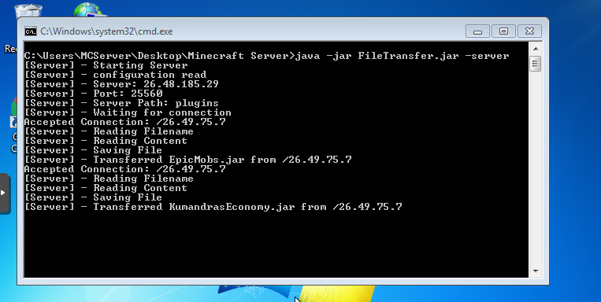
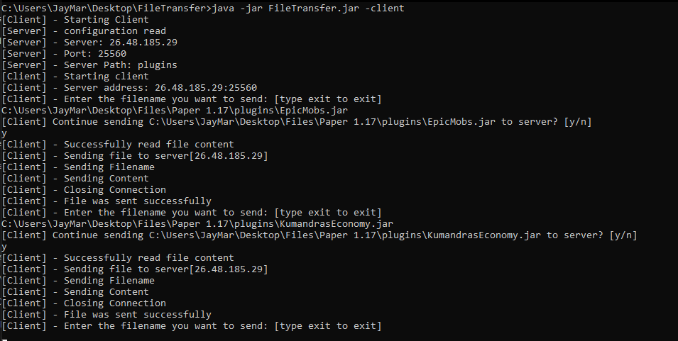

# FileTransfer_Java
A console based file transfer program
> by Jay

Allows clients to send files to server but they cannot recieve back the file, it was built in simple java socket programming

# Server Side

# Client Side

